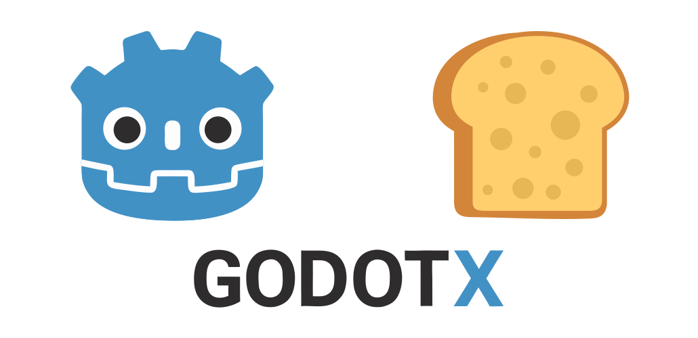
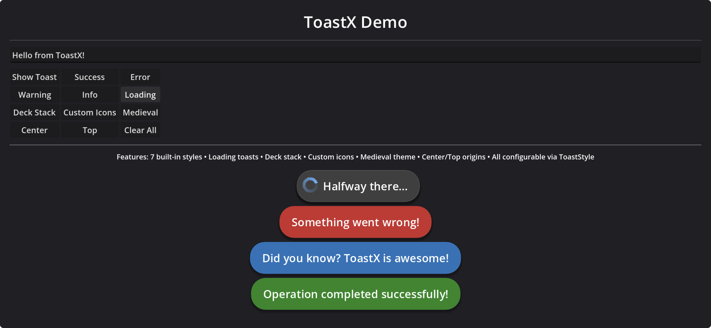
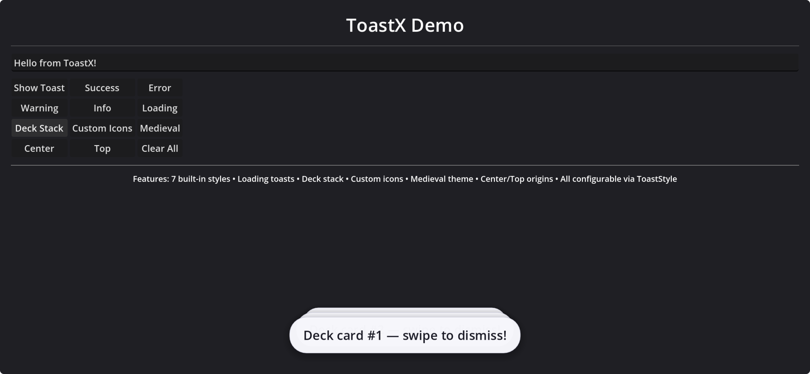

<p align="center">
    
</p>

# ToastX

A professional toast notification system for Godot 4.5+ with style-driven architecture.

## Features

- **One-line API**: Simple, intuitive global access
- **Style-driven**: Everything customizable via ToastStyle resources
- **7 Built-in styles**: Success, Warning, Info, Error, Light, Dark, Loading
- **9 Spawn origins**: Center, Top, Bottom, Left, Right, and corners
- **3 Animation types**: Slide, Fade, None
- **Smart stacking**: Per-origin stacking with configurable strategies
- **Deck Stack mode**: Card-deck style stacking with swipe to dismiss
- **Swipe gestures**: Swipe horizontal/vertical/both to dismiss
- **Loading Toasts**: Spinners and progress bars, stays until dismissed
- **Flexible content**: Support for null, Texture2D, or PackedScene
- **Responsive**: Auto-resizes with viewport changes
- **UI Scale aware**: Respects Godot's content scale factor

## Installation

1. Copy the `addons/toastx` folder into your Godot project
2. Enable the plugin in **Project Settings → Plugins**
3. The plugin automatically registers `ToastX` as an autoload singleton

## Basic Usage

```gdscript
# Simple one-liners
ToastX.show("Hello World!")
ToastX.success("Operation completed!")
ToastX.error("Something went wrong!")
ToastX.warning("Please check input")
ToastX.info("Did you know?")

# Loading toast
var id = ToastX.loading("Processing...")
ToastX.update_loading(id, 50.0)
ToastX.complete_loading(id, true, "Done!")

# Deck stack mode
var deck_style = ToastStyle.new()
deck_style.stack_strategy = ToastEnums.StackStrategy.DECK
deck_style.swipe_enabled = true
ToastX.show("Swipe me!", deck_style, 0)
```

## Demo

Open `scenes/demo/toastx_demo.tscn` to see all features in action.

## API Reference

### Main Methods

```gdscript
# Show a toast
ToastX.show(message: String, style = null, time = null, origin = -1, animation = -1) -> String

# Loading toasts
ToastX.show_loading(message: String, style = null, origin = -1, animation = -1) -> String
ToastX.update_loading(id: String, progress: float, new_message = "") -> bool
ToastX.complete_loading(id: String, success: bool = true, final_message = "") -> bool

# Quick helpers
ToastX.success(message: String, time = null) -> String
ToastX.error(message: String, time = null) -> String
ToastX.warning(message: String, time = null) -> String
ToastX.info(message: String, time = null) -> String
ToastX.loading(message: String, style = null) -> String

# Control
ToastX.dismiss(toast_id: String) -> bool
ToastX.clear_all()
ToastX.clear_by_origin(origin: ToastEnums.ToastOrigin)

# Configuration
ToastX.proportion = 30  # Width as % of viewport
ToastX.default_origin = ToastEnums.ToastOrigin.BOTTOM
ToastX.default_animation = ToastEnums.ToastAnimation.SLIDE
ToastX.default_time = ToastEnums.ToastTime.MEDIUM
```

### Signals

```gdscript
ToastX.toast_shown.connect(func(id): ...)
ToastX.toast_dismissed.connect(func(id, reason): ...)
ToastX.toast_clicked.connect(func(id): ...)
ToastX.loading_progress_updated.connect(func(id, progress): ...)
ToastX.loading_completed.connect(func(id, success): ...)
```

## Custom Styles

```gdscript
var style = ToastStyle.new()
style.background_color = Color.PURPLE
style.font_color = Color.WHITE
style.spinner_type = ToastEnums.SpinnerType.DEFAULT
style.swipe_enabled = true
style.stack_strategy = ToastEnums.StackStrategy.DECK

ToastX.show("Custom!", style)
```

## Screenshot




## License

This project is licensed under the [MIT License](LICENSE).

---

Made with ❤️ by Paulo Coutinho
